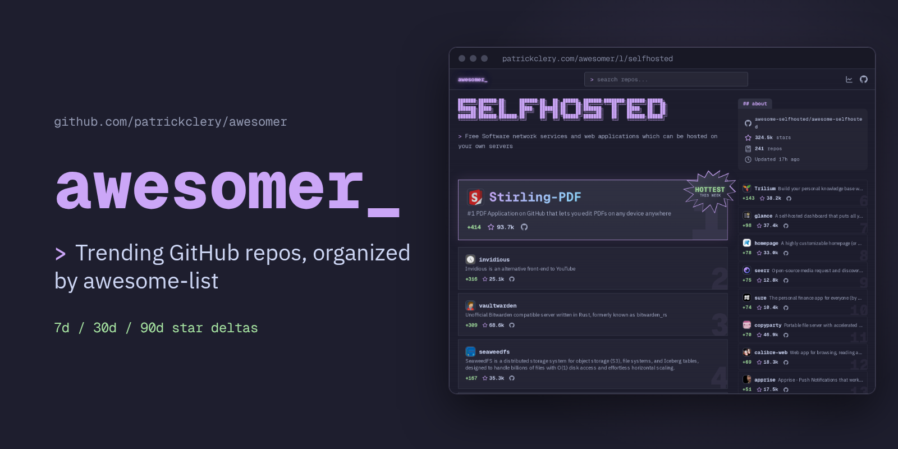
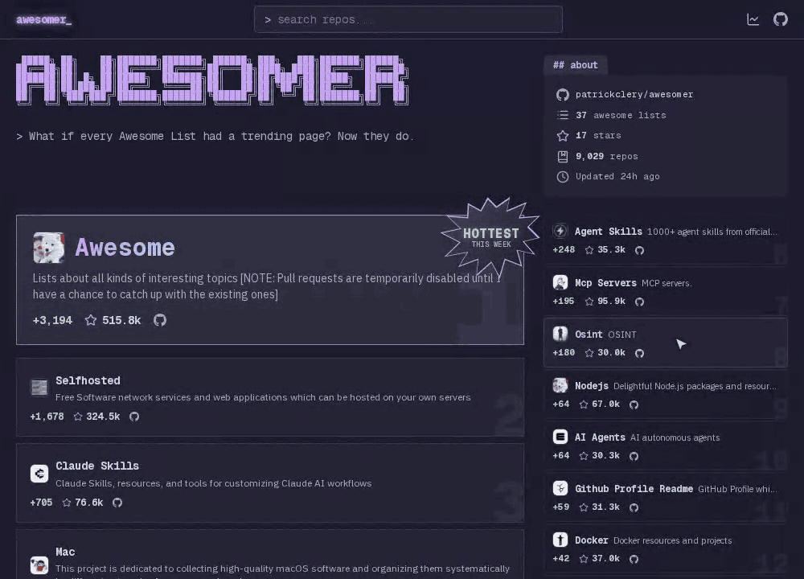

  

<h1 align="center">awesomer</h1>

  <strong>Trending GitHub repos, organized by awesome-list.</strong> 
  7d / 30d / 90d star deltas across curated awesome-lists.

  <a href="https://patrickclery.com/awesomer/">Live ↗</a> ·
  <a href="https://github.com/patrickclery/awesomer">GitHub ↗</a>

  

## Hottest This Week: [awesome](l/awesome.md)

> 😎 Awesome lists about all kinds of interesting topics [NOTE: Pull requests are temporarily disabled until I have a chan

| Stars | 7d | 30d | 90d |
|-------|----|-----|-----|
| 515,846 | +3,194 | +10,935 | +30,692 |

## Top 10 Trending Repos

| # | Repo | List | Stars | 7d |
|---|------|------|-------|----|
| 1 | [Agent-Reach](r/panniantong~agent-reach.md) | [Awesome Open Source AI](l/opensource-ai.md) | 92,919 | +6,640 |
| 2 | [skills](r/mattpocock~skills.md) | [awesome-agent-skills](l/agent-skills.md) | 278,751 | +6,234 |
| 3 | [impeccable](r/pbakaus~impeccable.md) | [Awesome Open Source AI](l/opensource-ai.md) | 78,036 | +5,250 |
| 4 | [VoiceStudio](r/debpalash~voicestudio.md) | [Awesome Open Source AI](l/opensource-ai.md) | 54,453 | +4,813 |
| 5 | [orca](r/stablyai~orca.md) | [Awesome Open Source AI](l/opensource-ai.md) | 86,788 | +4,787 |
| 6 | [ECC](r/affaan-m~ecc.md) | [Awesome Open Source AI](l/opensource-ai.md) | 274,536 | +4,646 |
| 7 | [everything-claude-code](https://github.com/affaan-m/everything-claude-code) |  | 274,536 | +4,645 |
| 8 | [archify](r/tt-a1i~archify.md) | [Awesome Open Source AI](l/opensource-ai.md) | 78,944 | +4,154 |
| 9 | [OpenShell](r/nvidia~openshell.md) | [Awesome Open Source AI](l/opensource-ai.md) | 15,202 | +4,069 |
| 10 | [hyperframes](r/heygen-com~hyperframes.md) | [Awesome Open Source AI](l/opensource-ai.md) | 58,211 | +3,822 |

## All Awesome Lists

| List | Description | Stars | 7d |
|------|-------------|-------|----|
| [awesome](l/awesome.md) | 😎 Awesome lists about all kinds of interesting topics [NOTE: Pull requests are temporarily disabled until I have a chan | 515,846 | +3,194 |
| [awesome-selfhosted](l/selfhosted.md) | A list of Free Software network services and web applications which can be hosted on your own servers | 324,516 | +1,678 |
| [awesome-claude-skills](l/claude-skills.md) | A curated list of awesome Claude Skills, resources, and tools for customizing Claude AI workflows | 76,639 | +705 |
| [awesome-mac](l/mac.md) |  This project is dedicated to collecting high-quality macOS software and organizing them systematically by different ca | 115,575 | +414 |
| [awesome-claude-code](l/claude-code.md) | A hand-picked collection of the finest of resources for the most awesome of agents, Claude Code, the undisputed champion | 55,189 | +349 |
| [awesome-agent-skills](l/agent-skills.md) | A curated collection of 1000+ agent skills from official dev teams and the community, compatible with Claude Code, Codex | 35,306 | +248 |
| [awesome-mcp-servers](l/mcp-servers.md) | A collection of MCP servers. | 95,897 | +195 |
| [awesome-osint](l/osint.md) | 😱 A curated list of amazingly awesome OSINT | 30,012 | +180 |
| [awesome-nodejs](l/nodejs.md) | ⚡ Delightful Node.js packages and resources [BECAUSE OF TOO MUCH SPAM AND LOW-QUALITY SUBMISSIONS, SUBMISSIONS ARE PAUSE | 67,026 | +64 |
| [Awesome AI Agents](l/ai-agents.md) | A list of AI autonomous agents | 30,289 | +64 |
| [awesome-github-profile-readme](l/github-profile-readme.md) | 😎 A curated list of awesome GitHub Profile which updates in real time  | 31,274 | +59 |
| [awesome-docker](l/docker.md) | 🐳 A curated list of Docker resources and projects | 36,977 | +42 |
| [awesome-shell](l/shell.md) | A curated list of awesome command-line frameworks, toolkits, guides and gizmos. Inspired by awesome-php. | 37,736 | +40 |
| [Awesome Open Source AI](l/opensource-ai.md) | Curated list of the best truly open-source AI projects, models, tools, and infrastructure. Daily updated. | 4,843 | +38 |
| [awesome-machine-learning](l/machine-learning.md) | A curated list of awesome Machine Learning frameworks, libraries and software. | 74,531 | +33 |
| [awesome-neovim](l/neovim.md) | Collections of awesome neovim plugins. | 21,461 | +32 |
| [awesome-cto](l/cto.md) | A curated and opinionated list of resources for Chief Technology Officers, with the emphasis on startups | 35,559 | +28 |
| [Awesome local LLM](l/local-llm.md) | A curated list of awesome platforms, tools, practices and resources that helps run LLMs locally | 2,937 | +26 |
| [awesome-actions](l/actions.md) | A curated list of awesome actions to use on GitHub | 28,291 | +24 |
| [awesome-arr](l/arr.md) | A collection of *arrs and related stuff. | 4,391 | +23 |
| [awesome-tunneling](l/tunneling.md) | List of ngrok, Cloudflare Tunnel, Tailscale, and ZeroTier alternatives and other tunneling software and services. Focus  | 21,921 | +22 |
| [awesome-cli-apps](l/cli-apps.md) | 🖥 📊 🕹 🛠 A curated list of command line apps | 20,505 | +19 |
| [awesome-ai-in-finance](l/ai-in-finance.md) | 🔬 A curated list of awesome LLMs & deep learning strategies & tools in financial market. | 6,644 | +14 |
| [awesome-zsh-plugins](l/zsh-plugins.md) | A collection of ZSH frameworks, plugins, themes and tutorials. | 18,049 | +8 |
| [awesome-nestjs](l/nestjs.md) | A curated list of awesome things related to NestJS 😎 | 13,165 | +8 |
| [awesome-tailwindcss](l/tailwindcss.md) | 😎 Awesome things related to Tailwind CSS | 15,196 | +6 |
| [awesome-ruby](l/ruby.md) | 💎 A collection of awesome Ruby libraries, tools, frameworks and software | 14,167 | +4 |
| [awesome-playwright](l/playwright.md) | A curated list of awesome tools, utils and projects using Playwright | 1,589 | +4 |
| [awesome-opensource-email](l/opensource-email.md) | Awesome Opensource Email Resources | 1,224 | +3 |
| [awesome-linux-containers](l/linux-containers.md) | A curated list of awesome Linux Containers frameworks, libraries and software | 2,104 | +2 |
| [awesome-db-tools](l/db-tools.md) | Everything that makes working with databases easier | 5,322 | +2 |
| [awesome-vite](l/vite.md) | ⚡️ A curated list of awesome things related to Vite.js | 17,264 | +2 |
| [Awesome Immich](l/immich.md) | Sites and packages for Immich | 18 | +1 |
| [awesome-piracy](l/piracy.md) | A curated list of awesome warez and piracy links | 26,914 | +1 |
| [awesome-postgres](l/postgres.md) | A curated list of awesome PostgreSQL software, libraries, tools and resources, inspired by awesome-mysql | 12,107 | +0 |
| [Awesome-Linux-Software](l/linux-software.md) | 🐧 A list of awesome Linux softwares  | 25,622 | -2 |
| [awesome-nextjs](l/nextjs.md) | 📔 📚 A curated list of awesome resources : books, videos, articles about using Next.js (A minimalistic framework for un | 11,102 | -4 |

---
*Updated: 2026-10-08 | [View live site ↗](https://patrickclery.com/awesomer/)*
